# Do You Remember...?

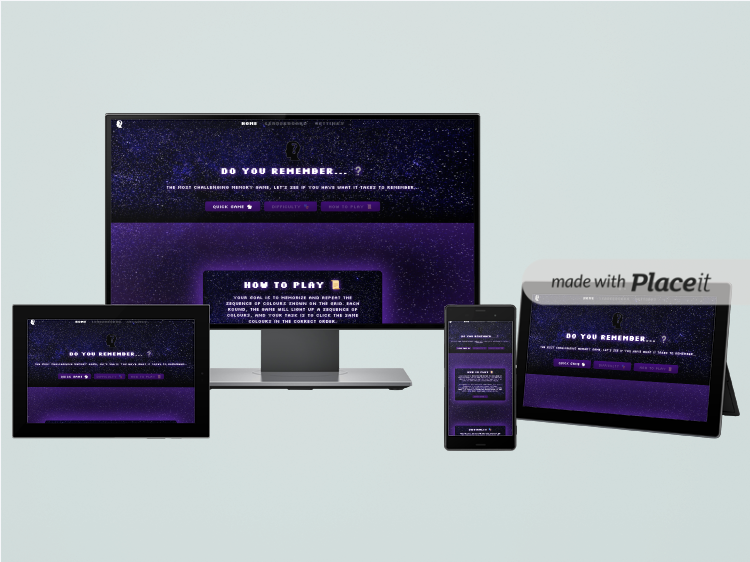

## Table of Contents

- [Project Overview](#-project-overview)
- [Project Rationale](#-project-rationale)
- [Features](#-features)
- [Objectives](#-project-objectives)
- [Goals and Values](#-mixed-goals)
- [Setup and Installation](#-setup-and-installation)
- [Game Logic Explanation](#-game-logic-explanation)
   - [Mechanics](#game-mechanics)
   - [Flow](#gameplay-flow-overview)
   - [Pattern Logic Functions](#-pattern-logic-functions)
   - [Local Storage](#-local-storage)
   - [Sound Integration](#-sound-integration)
   - [Settings Integration](#️-settings-integration)
   - [Leaderboard Functionality](#-leaderboard-functionality)
- [Deployment Guide](#-deployment-guide)
- [Version Control Practices](#-version-control-practices)
- [UX Design & Accessibility Compliance](#-ux-design--accessibility-compliance)
- [Future Enhancements](#-future-enhancements)
- [Author and Contact Information](#-author-and-contact-information)
- [Testing Documentation](TESTING.md)

---

*Project*: https://tylerrtdev.github.io/CI-MSProject2/

## 📌 **Project Overview**

The **Do You Remember** game is an engaging and interactive web-based memory game designed to test and improve players' memory skills through progressively challenging levels. Players are presented with a sequence of colored buttons that they must memorize and replicate accurately to advance. The game offers multiple difficulty levels, adjustable game speed, real-time score tracking, and an integrated leaderboard system. Designed with responsiveness in mind, the game ensures seamless gameplay on desktop, mobile, and tablet devices. It also emphasizes accessibility, intuitive user experience, and visually appealing animations and sounds to keep players engaged.

Key highlights include:
- **Dynamic Pattern Generation** for unique gameplay experiences every session.
- **Interactive User Interface** with real-time feedback.
- **Customizable Settings** to adjust speed and difficulty.
- **Persistent Data Storage** using LocalStorage for settings and scores.
- **Leaderboard Integration** to encourage competition.

The game serves as both a fun challenge and an educational tool for enhancing cognitive abilities.

### 💻 Technologies Used

- **HTML5:** Structure and layout.
- **CSS3:** Styling and responsive design.
- **JavaScript (ES6+):** Game logic and interactivity.
- **LocalStorage:** Persistent data storage.
- **Git & GitHub:** Version control and hosting.

---

## 📝 **Project Rationale**

The primary goal of the **Do You Remember** game is to create an accessible and enjoyable memory-enhancing experience that appeals to a wide range of users, from casual players seeking entertainment to individuals looking for cognitive training. With the increasing reliance on digital platforms, interactive games like this offer a unique opportunity to combine fun with cognitive skill development.

The rationale behind this project is driven by the following objectives:
1. **Educational Value:** Memory games have been shown to improve cognitive functions such as attention, focus, and short-term memory.
2. **Entertainment Factor:** By incorporating visually appealing designs, sound effects, and animations, the game aims to deliver an entertaining experience.
3. **Inclusivity:** The game is designed to be accessible across devices and user-friendly for individuals of all age groups.
4. **Replayability:** With dynamic patterns, adjustable difficulty, and a competitive leaderboard, the game encourages repeat play sessions.
5. **Technical Showcase:** The project demonstrates the integration of JavaScript, LocalStorage, and responsive design principles to deliver a seamless web application.

## 🚀 Features

- **Dynamic Difficulty Levels:** Easy, Medium, and Hard modes for tailored gameplay.
- **Adjustable Game Speed:** Customize speed settings for enhanced difficulty.
- **Leaderboard System:** Tracks the top 5 players' high scores.
- **Responsive Design:** Optimized for desktop and mobile devices.
- **Persistent Settings:** Settings are saved locally for seamless user experience.

---

## 🎯 **Project Objectives**
- I aim to implement **Dynamic Pattern Generation** where each game session presents a unique sequence.
- I want players to enjoy **Multiple Difficulty Levels**, including Easy, Medium, and Hard modes.
- I aim to provide **Adjustable Game Speed** for customizable challenge levels.
- I want the **User Interface** to offer real-time feedback with animations and sound effects.
- I aim to integrate a **Leaderboard System** to foster competition among players.
- I want to ensure **Local Storage Integration** so that user preferences and scores persist.
- I aim to deliver a **Responsive Design** optimized for desktops, tablets, and mobile devices.
- I want to include **Sound Effects** for actions like clicks, successes, and errors.
- I want **Score Tracking** to update in real-time during gameplay.
- I aim to provide **Customizable Settings** for game speed, difficulty, and preferences.
- I want to implement **Visual Animations** to make the game aesthetically appealing.
- I aim for an **Easy Restart Mechanism** that resets the game with a single click.
- I want **In-Game Instructions** to be clear and accessible at all times.
- I aim to handle **Real-Time Errors** gracefully with alerts and safeguards.
- I want **Session Persistence** so players can resume from where they left off.
- I aim to include **Social Sharing Links** for sharing achievements online.
- I aim for **Mobile-Friendly Controls**, including optimized button layouts.
- I want to include **Background Music** with optional controls for immersion.
- I aim for a **Secure Codebase** with proper validations and safeguards.

---

## 🎯 Goals & Values

### Value to Users
- **Clear Instructions:** Easy-to-follow guides help players understand game mechanics quickly.
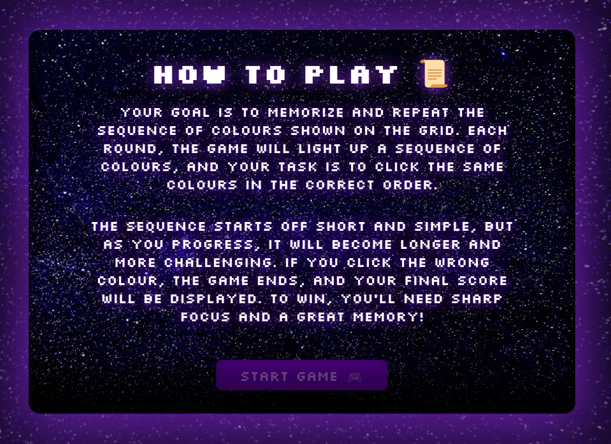

- **Score and Level Tracking:** Players can monitor their progress throughout the game.
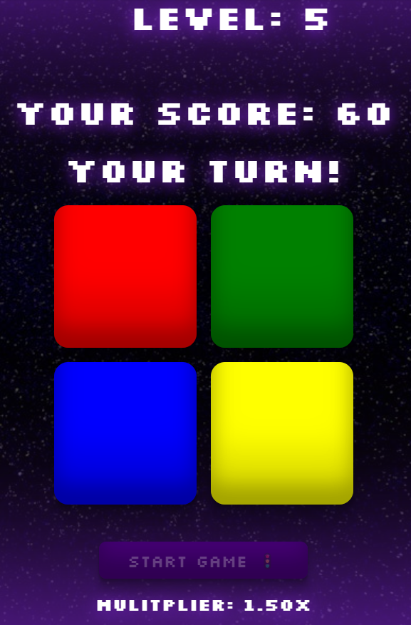

- **Cross-Platform Compatibility:** Ensures smooth gameplay across desktop and mobile devices.


- **Competitive Leaderboard:** Encourages competition by allowing players to see and compare top scores.
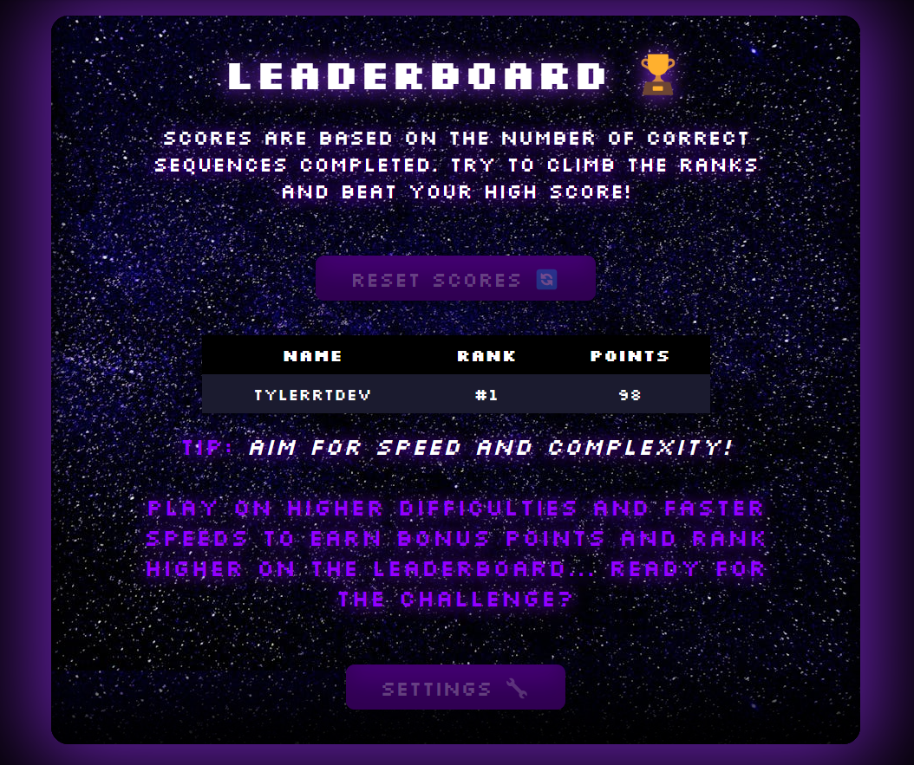
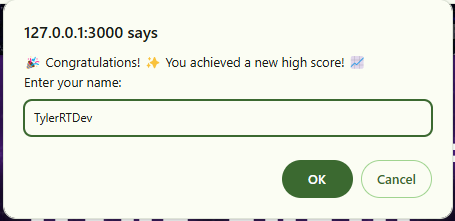
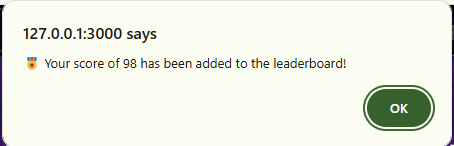

- **Challenging Gameplay:** Players can choose higher difficulties with complex patterns.
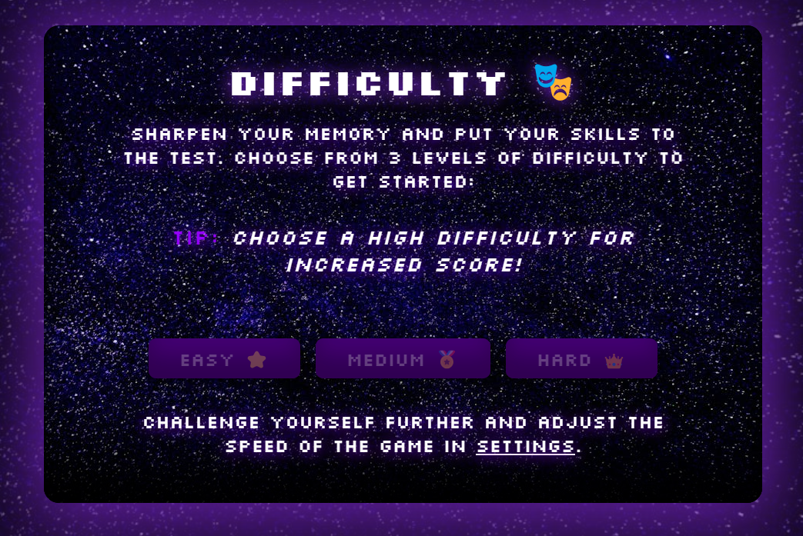
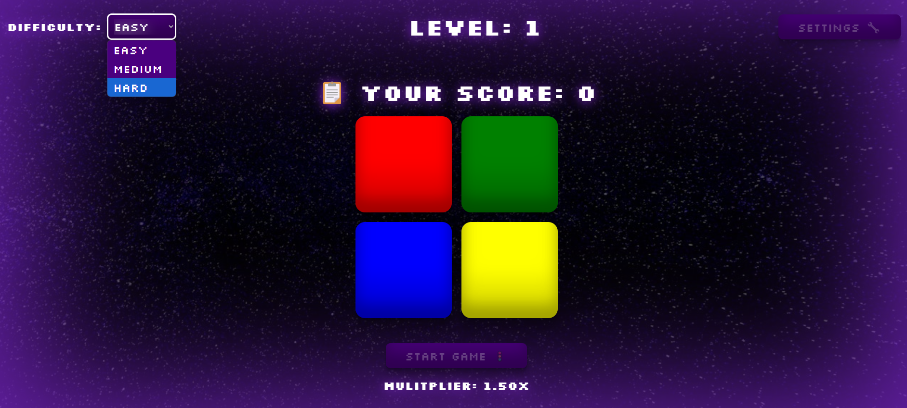
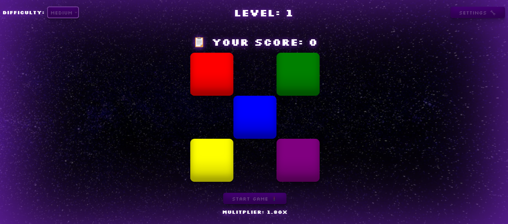
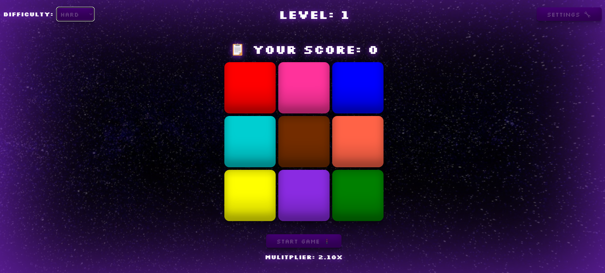

- **Tailored Experience:** Ensure players can adjust in game settings for a varied gameplay experience.
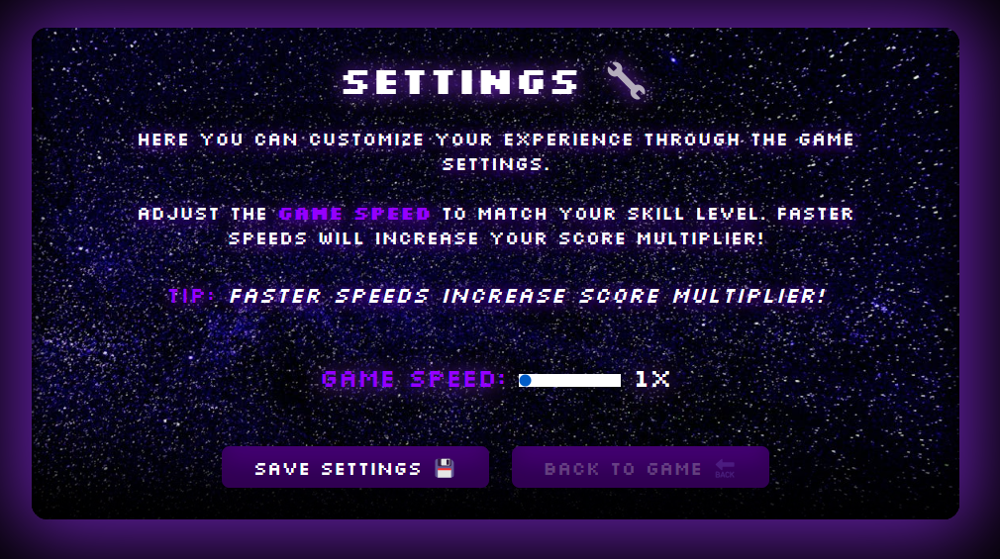
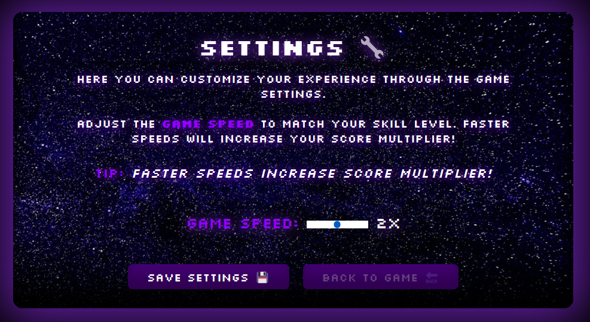
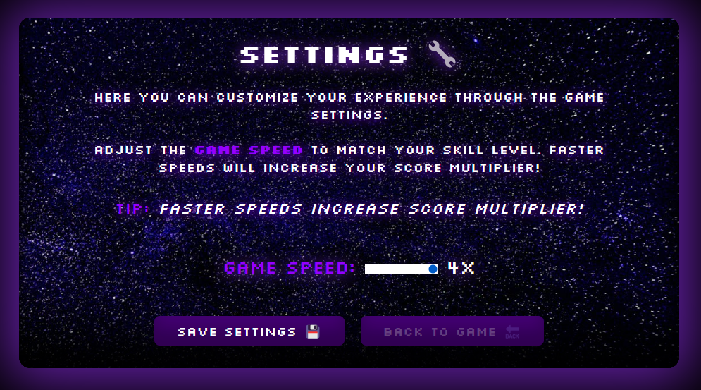


### 👩‍💼 **Client Goals**
1. I want the site to be simple to navigate and use.
2. I want to give the user a means of contacting the site owner.
3. I want the game to be intuitive and easy to understand, so that users of all ages can enjoy it.
4. I want the site to be accessible on multiple platforms (such as web, mobile, and tablets), so that users can play it on their preferred devices.
5. I want the site to have a visually appealing interface with good design principles and high-quality images, so that it attracts and engages users from the moment they visit.


### 💼 **Developer Goals**
1. I want a well-designed website that catches the attention of users.
2. I want a responsive website where the functionality is not impacted by screen size.
3. I want easy navigation that is intuitive and responsive.
4. I want a website designed with accessibility in mind.
5. I want a finished product that will proudly be displayed within my portfolio.

### 📱 **Responsive Design Goals**
- Ensure seamless gameplay on both mobile and desktop devices.
- Optimize layout for various screen resolutions.
- Utilize responsive CSS for dynamic content adjustment.
- Provide touch-friendly controls for mobile users.

---

## ⚙️ Setup and Installation


### Deployment Procedure

All steps below can be performed using <u>***Visual Studio Code***</u>.

To deploy the Pump Fitness Gym website, follow these detailed steps:

### 1. Obtain the Project Files:

You can obtain the project files either by cloning the repository or downloading them directly from GitHub.

#### **Option A: Clone the Repository:**

Cloning the repository allows you to have a local copy of the website's codebase, which you can easily update if the original repository changes.

1. **Open a terminal** on your local machine.
2. **Run the following command** to clone the repository:

```cmd
git clone https://github.com/TylerRTDev/CI-MSProject2.git 
```
This command will download the repository into a folder named `CI-MSProject2`.

3. **Navigate to the project directory:**

```cmd
cd CI-MSProject2
```
This places you inside the project directory where all the website files are located.

### Set Up the Environment:

Ensure you have a web server environment such as Apache or Nginx. For local testing, you can use a simple server with Python:

```cmd
python3 -m http.server 3000
```
This will start the python server.

### Configure Domain:
1. **Open a new terminal and type the following:**
```cmd
ipconfig
```
This will give you the ability to see what your ip address is.

2. **Copy the IP Address and combine it to the server address:**

Domain URL: `https://[your-ip-address-here]:3000/`

When you use `127.0.0.1` in a web browser, you're connecting to a server running on your own computer.

Open your web browser and navigate to your domain to verify that the website is working as expected.

### Test the Deployment:

If you have set up the server correctly you should also be able to navigate to the site via the following link: ***Domain URL example***: **```http://127.0.0.1:3000/```**

You can also use your own IP Address as an alternative.

---

## 🧠 Game Logic Explanation

### **Game Mechanics**
- **Pattern Generation:** Random sequences generated dynamically.
- **User Interaction:** Real-time response to player inputs.
- **Difficulty Scaling:** Adjustable game speed and complexity.
- **Score Tracking:** Immediate feedback and score updates after each round.

### **Gameplay Flow Overview:**
- The game generates a random sequence of colored buttons.
- Players must memorize and replicate the sequence.
- Each correct pattern increases the score and advances the level.
- Player score evaluated and added to the leaderboard if it qualifies. 

### 🧩 **Pattern Logic Functions**

#### **1. generatePattern**
<details>
<summary>View Code</summary>

```javascript
function generatePattern() {
    const randomIndex = Math.floor(Math.random() * buttons.length);
    gamePattern.push(buttons[randomIndex].dataset.id);
    playPattern();
}
```
</details>

- **Purpose:** Generates a random pattern by selecting a button ID from the grid and adds it to `gamePattern`.
- **Dependencies:** `buttons` (updated by `setDifficulty`), `playPattern`.
- **Previous Iteration:** Earlier versions used hardcoded button IDs and failed on difficulty changes.

---

#### **2. resetGame**

<details>
<summary>View Code</summary>

```javascript
function resetGame() {
    gamePattern = [];
    userPattern = [];
    gameScore = 0;
    gameLevel = 1;
    gameActive = false;
    scoreDisplay.textContent = `📋 Your Score: ${gameScore}`;
    levelDisplay.textContent = `Level: ${gameLevel}`;
    startMessageDisplay.textContent = '';
    endMessageDisplay.textContent = '';
}
```
</details>

- **Purpose:** Resets the game state, clearing patterns, score, and messages.
- **Dependencies:** `scoreDisplay`, `levelDisplay`, `startMessageDisplay`, `endMessageDisplay`.

---

#### **3. checkUserInput**
<details>
  <summary>View Code</summary>

```javascript
function checkUserInput() {
    const currentStep = userPattern.length - 1;

    if (userPattern[currentStep] === gamePattern[currentStep]) {
        if (userPattern.length === gamePattern.length) {
            const difficulty = difficultySelect.value;
            const speedMult = getMultiplier(gameSpeed);
            const diffMult = difficultyMultiplier[difficulty] || 1.0;
            const totalMultiplier = speedMult * diffMult;

            gameScore += Math.floor(10 * totalMultiplier);
            gameLevel++;
            scoreDisplay.textContent = `Your Score: ${gameScore}`;
            levelDisplay.textContent = `Level: ${gameLevel}`;

            userPattern = [];
            setTimeout(() => {
                startMessageDisplay.textContent = gameMessage;
                generatePattern();
            }, 5000 / gameSpeed);

            setTimeout(() => {
                levelUp();
            }, 500);
        }
    } else {
        endGame();
        setTimeout(() => {
            gameOver();
            resetGame();
        }, 1000);
    }
}
```
</details>

- **Purpose:** Validates the user's input pattern against the game-generated pattern.
- **Dependencies:** `difficultySelect`, `scoreDisplay`, `levelDisplay`, `generatePattern`.

---

## 💾 Local Storage

### **Overview:**
Local Storage is used throughout the game to ensure settings and player progress persist across browser sessions. Key areas of usage include:
- **Game Settings:** Game speed and difficulty preferences are stored and retrieved.
- **Leaderboard:** Player high scores are saved and displayed.
- **Session Data:** Tracks the current game state if the page is refreshed.

### **Local Storage Functions**

#### **1. loadSettings**

<details>
<summary>View Code</summary>

```javascript
function loadSettings() {
    const savedSettings = JSON.parse(localStorage.getItem('gameSettings')) || { gameSpeed: 1 };
    if (speedSettings[savedSettings.gameSpeed]) {
        gameSpeed = savedSettings.gameSpeed;
    } else {
        gameSpeed = 1;
    }
}
```
</details>

- **Purpose:** Loads user-selected game settings (e.g., speed, difficulty) from `localStorage`.
- **Dependencies:** `speedSettings`.

---

#### **2. saveHighScores**
<details>
<summary>View Code</summary>

```javascript
function saveHighScores() {
    localStorage.setItem('leaderboard', JSON.stringify(highScores));
}
```
</details>

- **Purpose:** Saves the top 5 player scores to `localStorage`.
- **Dependencies:** `highScores`.

---

#### **3. checkHighScore**
<details>
<summary>View Code</summary>

```javascript
function checkHighScore(finalScore) {
    let leaderboard = JSON.parse(localStorage.getItem('leaderboard')) || [];
    leaderboard.sort((a, b) => b.points - a.points);
    leaderboard = leaderboard.slice(0, 5);

    if (leaderboard.length < 5 || finalScore > leaderboard[leaderboard.length - 1].points) {
        const playerName = prompt("🎉 Congratulations! Enter your name:");

        if (playerName) {
            leaderboard.push({ name: playerName, points: finalScore });
            leaderboard.sort((a, b) => b.points - a.points);
            leaderboard = leaderboard.slice(0, 5);
            localStorage.setItem('leaderboard', JSON.stringify(leaderboard));
        }

        alert(`🎖️ Your score of ${finalScore} has been added to the leaderboard!`);
    } else {
        alert(`Game Over! Final Score: ${finalScore}`);
    }
}
```
</details>

- **Purpose:** Checks if the user's score qualifies for the Top 5 leaderboard and updates it.
- **Dependencies:** `localStorage`.

---

## 🔊 Sound Integration

### **Overview:**
Sound enhances interactivity in the game with effects on `onclick` and `mouseover` events. Sounds include button clicks, level progression, and game over alerts.

### **Web Sound Functions**
<details>
<summary>View Code</summary>

```javascript
function clickSound() {
    var audio = new Audio('resources/audio/btnClick.mp3');
    audio.play();
}
```
</details>

- **Purpose:** Plays a click sound when a button is pressed.

### **Server Sound Functions**
For server compatibility, relative paths are adjusted:
<details>
  <summary>Server Sound Function Example</summary>

```javascript
function clickSound() {
    var audio = new Audio('..\\resources\\audio\\btnClick.mp3');
    audio.play();
}
```
</details>

- **Purpose:** Adjusted paths ensure sounds play correctly in server environments.
- **Differences:** Paths use double backslashes (`..\\`) instead of single slashes.

#### **1. saveSettingsBtn**
<details>
  <summary>View Code</summary>

```javascript
function saveSettingsBtn() {
    var audio = new Audio("resources/audio/settingSaveBtn.mp3");
    audio.play();
}
```
</details>

- **Purpose:** Plays a sound when settings are saved.

---

#### **2. scrollEffect**
<details>
  <summary>View Code</summary>

```javascript
function scrollEffect() {
    var audio = new Audio("resources/audio/warp.mp3");
    audio.play();
}
```
</details>

- **Purpose:** Plays a sound effect when navigating using smooth scroll.

---

#### **3. caution**
<details>
  <summary>View Code</summary>

```javascript
function caution() {
    var audio = new Audio("resources/audio/caution.mp3");
    audio.play();
}
```
</details>

- **Purpose:** Plays a caution sound effect when interacting with reset or critical actions.

---

## 🛠️ Settings Integration

Players can customize their gameplay experience via the **Settings Page:**

- **Game Speed:** Adjust playback speed (0.5x, 1x, 1.5x).
- **Difficulty Levels:** Predefined settings for Easy, Medium, and Hard modes.

All settings are stored in `localStorage`, ensuring they persist across sessions.

### **Settings Functions**

#### **1. getSpeedMultiplier**
<details>
<summary>View Code</summary>

```javascript
function getSpeedMultiplier(speed) {
    switch (parseInt(speed, 10)) {
        case 1: return 1;
        case 2: return 2;
        case 3: return 4;
        default: return 1;
    }
}
```
</details>

- **Purpose:** Calculates the speed multiplier based on user-selected game speed.
- **Dependencies:** `speedRange`.
- **Previous Iteration:** Lacked proper validation for invalid inputs.

---


#### **2. getSpeedMultiplier**
<details>
<summary>View Code</summary>

```javascript
function getSpeedMultiplier(speed) {
    switch (parseInt(speed, 10)) {
        case 1: return 1;
        case 2: return 2;
        case 3: return 4;
        default: return 1;
    }
}
```
</details>

- **Purpose:** Converts speed values into a numerical multiplier.
- **Dependencies:** `speedRange`.

---


#### **3. loadSettings**
<details>
<summary>View Code</summary>

```javascript
function loadSettings() {
    const savedSettings = JSON.parse(localStorage.getItem('gameSettings')) || { gameSpeed: 1 };
    if (speedSettings[savedSettings.gameSpeed]) {
        gameSpeed = savedSettings.gameSpeed;
    } else {
        gameSpeed = 1;
    }
}
```
</details>

- **Purpose:** Loads game settings, such as speed, from `localStorage`.

---


## 🏆 Leaderboard Functionality

### **How It Works:**
- At the end of each game, scores are evaluated.
- If the player's score qualifies for the Top 5, they are prompted to enter their name.
- Scores are ranked and stored in `localStorage`.

### **Key Features:**
- Only the highest scores are recorded.
- Duplicate entries are avoided.
- Players are notified if they beat a previous high score.

### **Leaderboard Functions**

#### **1. displayLeaderboard**
<details>
<summary>View Code</summary>

```javascript
function displayLeaderboard() {
    const leaderboardBody = document.getElementById("leaderboard-body");
    leaderboardBody.innerHTML = "";
    leaderboard.sort((a, b) => b.points - a.points);
    leaderboard.forEach((entry, index) => {
        const row = `<tr><td>${entry.name}</td><td>#${index + 1}</td><td>${entry.points}</td></tr>`;
        leaderboardBody.insertAdjacentHTML('beforeend', row);
    });
}
```
</details>

- **Purpose:** Displays the leaderboard data on the UI.
- **Dependencies:** `leaderboard`.

---

#### **2. resetLeaderboard**
<details>
<summary>View Code</summary>

```javascript
document.getElementById("reset-scores").addEventListener("click", () => {
    localStorage.removeItem('leaderboard');
    saveBtn();
    setTimeout(() => {
        window.location.reload();
        alert('ℹ Leaderboard Reset!');
    }, 1000);
});
```
</details>

- **Purpose:** Clears the leaderboard from `localStorage` and refreshes the page.
- **Dependencies:** `leaderboard`, `saveBtn`.

---

#### **3. displayLeaderboard**
<details>
<summary>View Code</summary>

```javascript
function displayLeaderboard() {
    const leaderboardBody = document.getElementById("leaderboard-body");
    leaderboardBody.innerHTML = "";

    leaderboard.sort((a, b) => b.points - a.points);
    leaderboard.forEach((entry, index) => {
        const row = `<tr><td>${entry.name}</td><td>#${index + 1}</td><td>${entry.points}</td></tr>`;
        leaderboardBody.insertAdjacentHTML('beforeend', row);
    });
}
```
</details>

- **Purpose:** Dynamically displays leaderboard scores on the UI.
- **Dependencies:** `leaderboardBody`.


---

## 🚀 Deployment Guide

The game is deployed using **GitHub Pages:**


1. **Push Changes:** Ensure all updates are pushed to the repository.
2. **Enable GitHub Pages:**
   - Go to repository settings.
   - Select `main` branch and `/root` directory in GitHub Pages.
   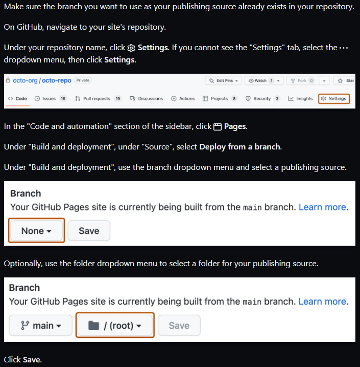
3. **Access the Game:**
   - Visit: `https://tylerrtdev.github.io/CI-MSProject2/`

---

## 📂 Version Control Practices

- **Feature Branches:** Used for new features and bug fixes.
- **Frequent Commits:** Regular updates with clear commit messages.
- **Tags:** Significant versions tagged for clarity.

---

## 🎨 UX Design & Accessibility Compliance

- **Semantic HTML:** Enhances clarity and accessibility.
- **Responsive Design:** Optimized for mobile and desktop.
- **ARIA Labels:** Used for improved screen reader compatibility.
- **Color Contrast:** Meets WCAG standards.

---

## 🔮 Future Enhancements

- **Multiplayer Mode:** Real-time competition.
- **Additional Levels:** Custom difficulty settings.
- **Advanced Animations:** Smooth transitions and visual effects.

---

## 👤 Author and Contact Information

**Developed by:** TylerRTDev
**Email:** tylerrtdev@outlook.com  
**GitHub:** [https://github.com/TylerRTDev](https://github.com/TylerRTDev)  

---

